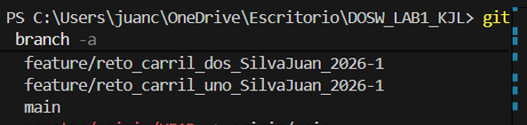
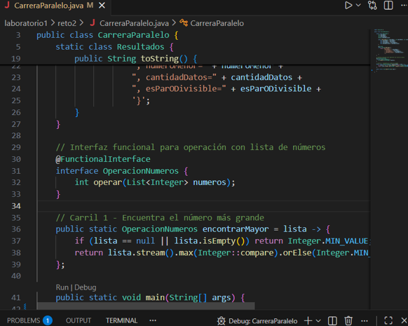
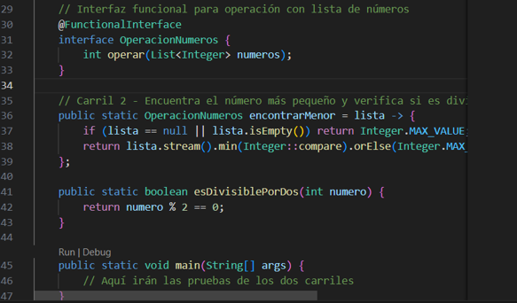
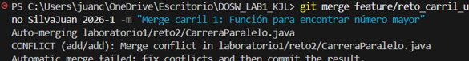
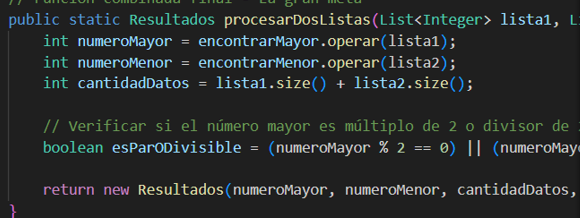
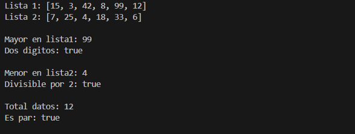
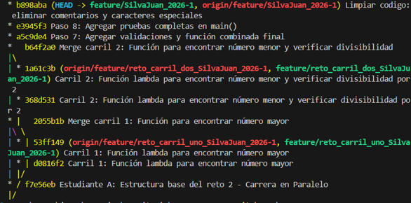
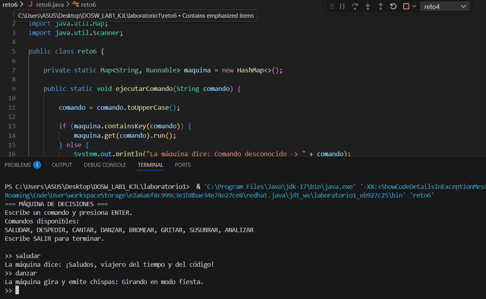

# DOSW_LAB1_KJL
Desarrollo primer laboratorio DOSW
# NOMBRES:
-	Laura Nicol Castillo Forero
-	Kevin Arturo Cuitiva Pardo 
-	Juan David Silva Camacho
 
# FORMA DE TRABAJO:
Como equipo de trabajo, se acordó aprovechar de manera eficiente el tiempo asignado durante el horario de clase para adelantar la mayor parte del desarrollo del laboratorio. Durante estas sesiones presenciales se realizará el análisis general del laboratorio, la revisión de los requerimientos y la planificación de las actividades necesarias para su correcta implementación.

La parte restante del laboratorio será desarrollada durante la semana y el fin de semana mediante una reunión virtual a través de Microsoft Teams, cuyo objetivo principal será completar el desarrollo del laboratorio, resolver dudas pendientes y realizar el envío final del trabajo.

Para garantizar un desarrollo organizado y colaborativo, se establecieron las siguientes actividades y asignaciones:

- Lectura y análisis del laboratorio y los retos:
  Todos los integrantes del equipo realizarán la lectura completa del laboratorio y de los retos propuestos, con el fin de comprender claramente los objetivos, requerimientos y posibles dificultades.
 
-Asignación de retos individuales:
  Cada integrante del equipo tendrá asignado uno o varios retos específicos, los cuales deberá intentar desarrollar de manera individual. Este trabajo permitirá identificar posibles errores, dudas o alternativas    de solución.

- Socialización de resultados y resolución de dudas:
  Durante la reunión del fin de semana, cada integrante presentará los avances obtenidos, las dificultades encontradas y las soluciones propuestas. A partir de esta socialización, el equipo resolverá las dudas y   unificará criterios para asegurar un desarrollo correcto y coherente del laboratorio.

- Control de versiones y trabajo colaborativo:
  Se crearán ramas individuales en el repositorio para cada una de las soluciones desarrolladas. Posteriormente, una vez validadas y corregidas, se realizará el proceso de merge hacia la rama principal (main),      integrando de manera ordenada todos los puntos requeridos en el laboratorio.

## RETOS COMPLETADOS

### Reto #1: La Bienvenida 
**Desarrollado por:** Kevin Cuitiva  
**Descripción:** Implementación de una expresión lambda para imprimir un saludo de bienvenida utilizando streams, map() y collect(). Los estudiantes están almacenados en una estructura de datos List.
### Evidencia del reto 

### RETO 2: La carrera paralela

Se crearon dos ramas una para cada estudiante

Después de crear las ramas cada estudiante agrega su parte correspondiente (la primera el StringBuilder y la segunda el StringBuffer) y se procede a hacer el commit de cada una al final queda así.

Esto era cada commit correspondiente a cada estudiante y en la rama principal del reto se hace el merge de las dos ramas, una la del Carril 1 con el StringBuilder y otra la del Carril 2 con el StringBuffer y se soluciona los conflictos que se presentan y así queda el código final.

Después en el Carril 1, se hace el commit correspondiente y luego se hace un merge con la rama principal (Carril 1) y se hace push de todo.

Hacemos lo mismo con el Carril 2, y hacemos un merge con la rama principal (Carril 2) y se hace push de todo.

Después con el código final funcional, se hace un commit final y queda el grafo así.

# RETO 3

Se crearon dos ramas, una para cada estudiante.

Después de crear las ramas cada estudiante agrega su parte correspondiente (la primera el StringBuilder y la segunda el StringBuffer) y se procede a hacer el commit de cada una, al final queda así.

Esto era cada commit correspondiente a cada estudiante y en la rama principal del reto se hace el merge de las dos ramas, una la del Builder con el StringBuilder y otra la del Buffer con el StringBuffer y se solucionan los conflictos que se presentan y así queda el código final.

Después en el Builder, se hace el commit correspondiente y luego se hace un merge con la rama principal (Builder) y se hace push de todo.

Hacemos lo mismo con el Buffer, y hacemos un merge con la rama principal (Buffer) y se hace push de todo.

### RETO 4: El tesoro de las llaves duplicadas

**Desarrollado por:** Laura Nicol Castillo Forero

**Descripción:**
En este reto se implementó la combinación de dos estructuras de datos (HashMap y Hashtable) desarrolladas en ramas separadas del repositorio, aplicando buenas prácticas de control de versiones con Git.

Inicialmente, se desarrolló una solución utilizando HashMap, la cual almacena pares clave-valor ignorando claves duplicadas y conservando el primer valor ingresado. Posteriormente, se implementó una versión alternativa usando Hashtable, asegurando sincronización y permitiendo la sobrescritura de valores en caso de claves repetidas.

Finalmente, se realizó el proceso de merge en la rama principal del reto, resolviendo los conflictos generados y unificando ambas implementaciones en una única solución final que:

- Prioriza los valores provenientes del Hashtable en caso de conflicto
- Convierte todas las claves a mayúsculas antes de imprimir
- Ordena los resultados de forma ascendente
- Utiliza stream(), map(), sorted() y Collectors.toMap() con expresiones lambda
- Permite el ingreso de datos por parte del usuario desde consola

**Evidencia del reto:**

Rama con implementación usando HashMap

Rama con implementación usando Hashtable

Rama principal con integración final y resolución de conflictos

### Reto #5: Batalla de Conjuntos 
**Desarrollado por:** Kevin Cuitiva  
**Descripción:** Simulación de una batalla donde dos equipos (HashSet y TreeSet) almacenan números. HashSet elimina múltiplos de 3 sin orden, mientras TreeSet elimina múltiplos de 5 manteniendo orden ascendente. Al final, ambas colecciones se unen eliminando duplicados. Utiliza stream().filter() con lambdas para el filtrado y forEach() con lambdas para la impresión de resultados.
### Evidencia del reto 

### RETO 6: Máquina de decisiones

**Desarrollado por:** Laura Nicol Castillo Forero

**Descripción:**
En este reto se desarrolló una máquina de decisiones interactiva en Java, cuyo objetivo principal fue implementar un sistema capaz de ejecutar distintas acciones a partir de comandos ingresados por el usuario desde la consola.

La solución se basa en el uso de un Map<String, Runnable>, donde cada clave representa un comando y cada valor corresponde a una acción específica que la máquina puede ejecutar. Este enfoque permitió evitar estructuras condicionales extensas (if-else o switch), logrando un diseño más limpio, flexible y escalable.

El desarrollo del reto se realizó dividiendo la inicialización de los comandos en dos fragmentos lógicos, los cuales fueron integrados posteriormente en una única solución funcional.

La versión final del programa cumple con las siguientes características:

- Permite al usuario ingresar comandos dinámicamente desde la consola.
- Ejecuta acciones asociadas a cada comando utilizando expresiones lambda.
- Convierte los comandos ingresados a mayúsculas para evitar errores por diferencias de formato.
- Maneja correctamente los comandos desconocidos mostrando un mensaje informativo.
- Incluye un comando especial (SALIR) que finaliza la ejecución del programa de forma controlada.
- Facilita la extensión del sistema mediante la adición de nuevos comandos sin modificar la lógica principal.

Este reto permitió reforzar conceptos relacionados con programación funcional en Java, uso de colecciones, lambdas, y diseño modular, además de fomentar buenas prácticas de legibilidad y mantenimiento del código.

**Evidencia del reto:**

Implementación de la máquina de decisiones con comandos interactivos y ejecución del programa solicitando comandos al usuario y mostrando las respuestas correspondientes

