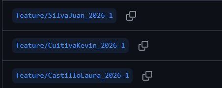
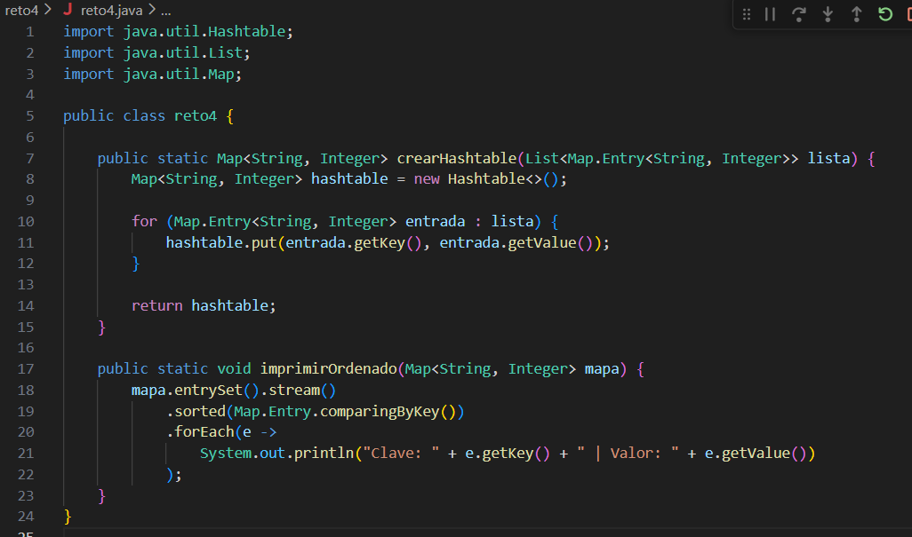
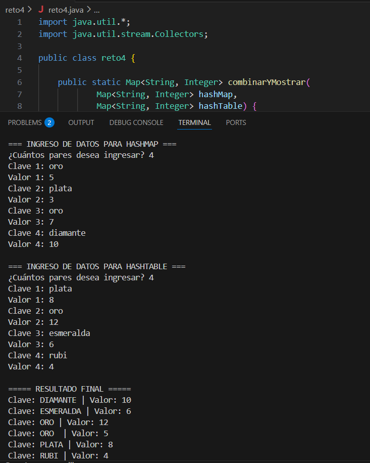

# DOSW_LAB1_KJL
Desarrollo primer laboratorio DOSW
# NOMBRES:
-	Laura Nicol Castillo Forero
-	Kevin Arturo Cuitiva Pardo 
-	Juan David Silva Camacho
 
# FORMA DE TRABAJO:
Como equipo de trabajo, se acordó aprovechar de manera eficiente el tiempo asignado durante el horario de clase para adelantar la mayor parte del desarrollo del laboratorio. Durante estas sesiones presenciales se realizará el análisis general del laboratorio, la revisión de los requerimientos y la planificación de las actividades necesarias para su correcta implementación.

La parte restante del laboratorio será desarrollada durante la semana y el fin de semana mediante una reunión virtual a través de Microsoft Teams, cuyo objetivo principal será completar el desarrollo del laboratorio, resolver dudas pendientes y realizar el envío final del trabajo.

Para garantizar un desarrollo organizado y colaborativo, se establecieron las siguientes actividades y asignaciones:

- Lectura y análisis del laboratorio y los retos:
  Todos los integrantes del equipo realizarán la lectura completa del laboratorio y de los retos propuestos, con el fin de comprender claramente los objetivos, requerimientos y posibles dificultades.

-Asignación de retos individuales:
  Cada integrante del equipo tendrá asignado uno o varios retos específicos, los cuales deberá intentar desarrollar de manera individual. Este trabajo permitirá identificar posibles errores, dudas o alternativas    de solución.

- Socialización de resultados y resolución de dudas:
  Durante la reunión del fin de semana, cada integrante presentará los avances obtenidos, las dificultades encontradas y las soluciones propuestas. A partir de esta socialización, el equipo resolverá las dudas y   unificará criterios para asegurar un desarrollo correcto y coherente del laboratorio.

- Control de versiones y trabajo colaborativo:
  Se crearán ramas individuales en el repositorio para cada una de las soluciones desarrolladas. Posteriormente, una vez validadas y corregidas, se realizará el proceso de merge hacia la rama principal (main),      integrando de manera ordenada todos los puntos requeridos en el laboratorio.

# RETOS COMPLETADOS

Reto #4: El tesoro de las llaves duplicadas

Desarrollado por: Laura Nicol Castillo Forero

Descripción:
En este reto se implementó la combinación de dos estructuras de datos (HashMap y Hashtable) desarrolladas en ramas separadas del repositorio, aplicando buenas prácticas de control de versiones con Git.

Inicialmente, se desarrolló una solución utilizando HashMap, la cual almacena pares clave-valor ignorando claves duplicadas y conservando el primer valor ingresado. Posteriormente, se implementó una versión alternativa usando Hashtable, asegurando sincronización y permitiendo la sobrescritura de valores en caso de claves repetidas.

Finalmente, se realizó el proceso de merge en la rama principal del reto, resolviendo los conflictos generados y unificando ambas implementaciones en una única solución final que:

- Prioriza los valores provenientes del Hashtable en caso de conflicto

- Convierte todas las claves a mayúsculas antes de imprimir

- Ordena los resultados de forma ascendente

- Utiliza stream(), map(), sorted() y Collectors.toMap() con expresiones lambda

- Permite el ingreso de datos por parte del usuario desde consola

Evidencia del reto

Rama con implementación usando HashMap

Rama con implementación usando Hashtable

Rama principal con integración final y resolución de conflictos

